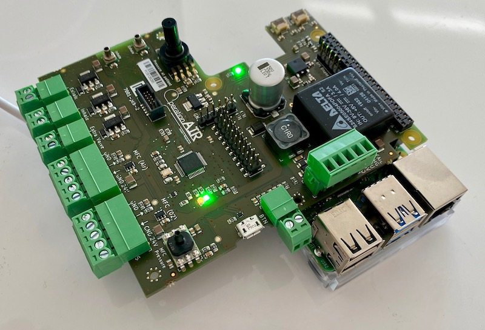

# Electronics and firmware for Operation Air Ventilator

The electronics for the Operation Air AIROne is comprised of a custom developed PCB with a LPC11U37 microcontroller stacked on top of a Raspberry Pi 4 (Model B).

This repository contains the electronic designs for the PCB and the accompanying firmware.

The Pi talks to the microcontroller over UART using a [custom binary protocol](firmware/README.md#uart-communication-protocol).
