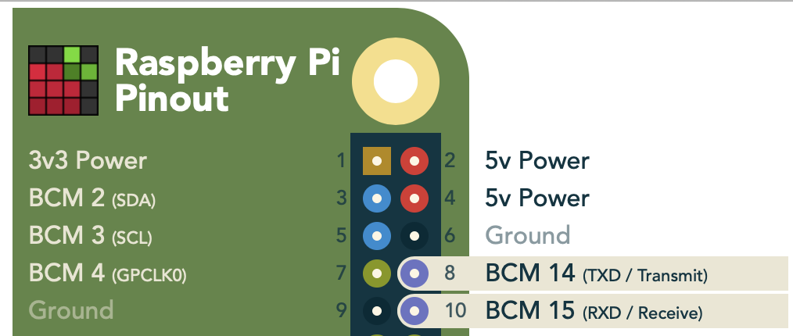

# Operation Air embedded firmware

The firmware runs on a LPC11U37 microcontroller.

## Requirements

* [Gnu Arm Embedded Toolchain](https://developer.arm.com/open-source/gnu-toolchain/gnu-rm/downloads)
* CMake
* JTAG/SWD programmer, such as the [Black Magic Probe](https://github.com/blacksphere/blackmagic/wiki) (BMP) , or any OpenOCD compatible device.


## Build

First we need to create a `config.cmake` file in which we can configure our build

```console
cp config.cmake.example config.cmake
```

In `config.cmake` we can configure the BMP if we're using any. On MacOS that would look like:

```
set(BLACKMAGIC_DEV /dev/cu.usbmodemC1DDCDF81)
```

Next we need to create a `build` directory in the project root and run CMake to fetch all dedpendencies and create the makefiles.

```console
mkdir build
cd build
cmake ..
```

The previous part only needs to be done the first time.
Now we're ready to actually compile the project. Inside the `build` directory run

```console
make
```

And to flash

```console
make flash
```


## UART Communication Protocol

The microcontroller communicates with a Raspberry Pi over `uart`. The PCB is designed as a Raspberry Pi Hat and uses the `TXD` and `RXD` pins in the Raspberry Pi header. Note that `Rx` and `Tx` are swapped on the microcontroller side.



A binary protocol is used where each command is a unique 32 bit integer (sent LSB first) followed by an optional payload.

The baudrate is `500000`.

Binary responses from the microcontroller for the specific command are also prefixed with the same 4 bytes. ASCII responses, for logging or debug puposes are prefixed with `0x23232323` ('####') and end in a newline `\n` character.

### Command Overview

| Command             | Description                             | Prefix     | Payload      | Response         |
| -------------       |---------------------------------------- | ---------: | ------------ | --------         |
| NewSettings         | Send and apply new operation settings   | `0x41424344` | [Settings](#Settings)   | Applied Settings |
| RequestSettings     | Request current settings                | `0x45464748` | None         | [Settings](#Settings-Response) |
| RequestSensorValues | Request current samples for all sensors | `0x0D15EA5E` | None         | [Sensor Values](#Sensor-Values-Response)    |
| InspiratoryHoldStart| Trigger inspiratory hold if breathing is started | `0x99998888` | None| Log info (ascii) |
| InspiratoryHoldStop | Stop inspiratory hold                   | `0x99999999` | None         | Log info (ascii) |
| ExpiratoryHoldStart | Trigger expiratory hold if breathing is started | `0x77776666` | None | Log info (ascii) |
| ExpiratoryHoldStop  | Stop expiratory hold                    | `0x77777777` | None         | Log info (ascii) |
| StatusLedOn         | Turn on status LED (Green)              | `0x55551111` | None         | Log info (ascii) |
| StatusLedOff        | Turn off status LED (Green)             | `0x55661111` | None         | Log info (ascii) |
| ErrorLedOn          | Turn on error LED (Red)                 | `0x55552222` | None         | Log info (ascii) |
| ErrorLedOff         | Turn off error LED (Red)                | `0x55662222` | None         | Log info (ascii) |
| SwitchExhaleOn      | Turn on 24V switch for exhale           | `0x66663333` | None         | Log info (ascii) |
| SwitchExhaleOff     | Turn off 24V switch for exhale          | `0x66773333` | None         | Log info (ascii) |
| SwitchInhaleOn      | Turn on 24V switch for inhale           | `0x66664444` | None         | Log info (ascii) |
| SwitchInhaleOff     | Turn off 24V switch for ihale           | `0x66774444` | None         | Log info (ascii) |
| SwitchExtraOn       | Turn on 24V switch (extra)              | `0x66665555` | None         | Log info (ascii) |
| SwitchExtraOff      | Turn off 24V switch (extra)             | `0x66775555` | None         | Log info (ascii) |
| MFCAirSet           | Set 12 bit analog value for MFC (Air)   | `0x77771111` | [uint16 (mV)](#MFC-set-point) | Log info (ascii) |
| MFCAirGet           | Get analog MFC (Air) feedback value     | `0x77881111` | None         | [MFC Feedback uint16 (mV)](#MFC-analog-in)  |
| MFCO2Set            | Set 12 bit analog value for MFC (O2)    | `0x77772222` | [uint16 (mV)](#MFC-set-point) | Log info (ascii) |
| MFCO2Get            | Get analog MFC (O2) feedback value      | `0x77882222` | None         | [MFC Feedback uint16 (mV)](#MFC-analog-in)  |
| UserSwitchGet       | Get current user switch status (0 or 1) | `0x88883333` | None         | 0 or 1 (ascii)   |

### Settings

Settings is defined as a struct where each entry is a 16 bit unsigned integer.

```
typedef struct __attribute__((packed)) {
    uint16_t start; // breathing is started
    uint16_t peep; // exhale pressure
    uint16_t frequency; // breathing cycles per minute
    uint16_t ratio; // ratio between inhale exhale
    uint16_t pressure; // inhale pressure
    uint16_t oxygen; // oxygen percentage for mixer
    uint16_t max_pressure_alarm;
    uint16_t min_pressure_alarm;
    uint16_t max_TV_alarm;
    uint16_t min_TV_alarm;
    uint16_t max_fiO2_alarm;
    uint16_t min_fiO2_alarm;
    uint16_t crc;
} OperationSettings;
```

The final entry is a `crc16 usb` checksum with the following specs:

```
CRC16 USB
Poly: 0x8005
Init: 0xFFFF
RefIn: True
RefOut: True
XorOut: 0xFFFF
```


### Sensor Values Response

From microcontroller to host.
Sensor values are prefixed with the 32-bit little-endian value `0x0D15EA5E` and followed by a crc16 usb checksum. The sensor data is a struct of 32bit signed integers:

The total data packet is then `4 + (14 x 4) + 2 = 62 bytes`

```
struct SensorsAllData {
    int32_t flow_inhale;        // Inhale flow [mL / minute] (approximation)
    int32_t flow_exhale;        // Exhale flow [mL / minute]

    int32_t pressure_inhale;    // Inhale pressure [Pa]
    int32_t pressure_exhale;    // Exhale pressure [Pa]
    int32_t pressure_patient;   // Pressure at patient [Pa] (TODO: Not Implemented Yet)
    int32_t pressure_mfc;       // Pressure at MFC pressure vessel [Pa]

    int32_t oxygen;             // Oxygen percentage [0-100]
    int32_t tidal_volume_inhale;       // Tidal volume [mL] (Based on inhale flow)
    int32_t tidal_volume_exhale;       // Tidal volume [mL] (Based on exhale flow)
    int32_t minute_volume;      // Average flow (exhale) [mL / minute] (average over last 10 sec interval)
    int32_t cycle_state;        // PeeP / Peak / None
    int32_t power_status;       // UPS status [mV OR-ed with UPSStatus bits]

    int32_t inspiratory_hold_result;   // Value for end of inspiratory hold mean sensors
    int32_t expiratory_hold_result;   // Value for end of expiratory hold mean sensors

}
```

The power_status field shows the measured power voltage in mv, OR-combined with one
of these status flags:
```
enum UPSStatus {
    UPS_STATUS_UNKNOWN              = (0),
    UPS_STATUS_OK                   = (1 << 31),
    UPS_STATUS_BATTERY_POWERED      = (1 << 30),
    UPS_STATUS_FAIL                 = (1 << 29)
};

```

### Settings Response

From microcontroller to host.
Settings are prefixed with the 32-bit little-endian value: `0x41424344`, followed by the [Settings](#Settings).

### MFC set point

Set point for the mass flow controller. The MFC is controlled through a 12bit i2c DAC. The payload for the MFC set command accepts a unsigned 16 bit integer between 0 and 4095.

### MFC analog in

Feedback from the MFC are returned as uint16 value in millivolts (0-5000). Note: this command is binary and is not terminated with '\n'.

